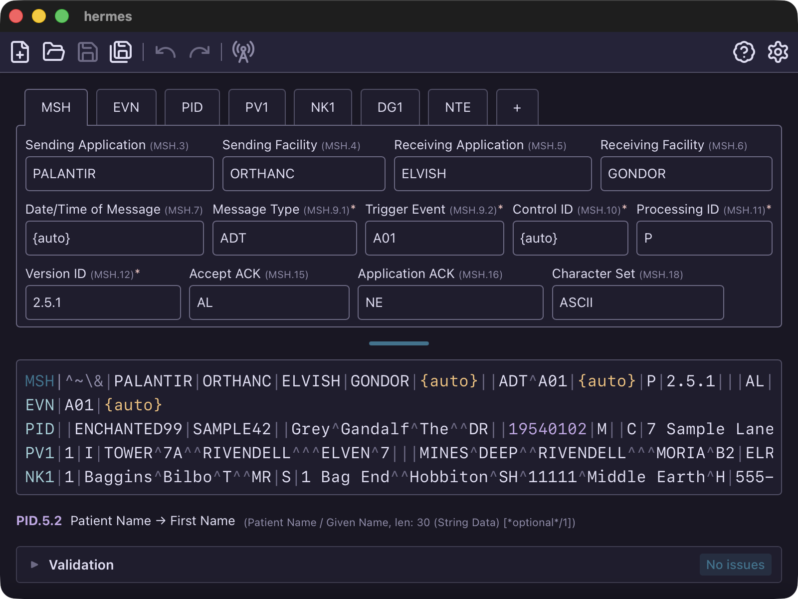

# Hermes

Hermes is a desktop app for composing, sending, and receiving HL7v2 messages.

## HL7v2?

[HL7 v2.x](https://en.wikipedia.org/wiki/Health_Level_7#HL7_Version_2) is a
messaging standard used throughout healthcare. When a patient gets admitted, a
lab result comes back, or a prescription gets filled, there's usually an HL7
message behind it. These messages are pipe-delimited text that looks something
like this:

```hl7
MSH|^~\&|PALANTIR|ORTHANC|ELVISH|GONDOR|20241207120000||ADT^A01|MSG001|P|2.5.1|||AL|NE||ASCII
EVN|A01|20241207120000
PID||ENCHANTED99|SAMPLE42||Grey^Gandalf^The^^DR||19540102|M||C|7 Sample Lane^^Hobbiton^SH^11111^Middle Earth^H||555-RING-ONE|555-SHIRE-42||||POTION777|987-65-4321|||||||||||A
PV1|1|I|TOWER^7A^^RIVENDELL^^^ELVEN^7|||MINES^DEEP^^RIVENDELL^^^MORIA^B2|ELR001^Halfelven^Elrond^P|GAL002^Celeborn^Galadriel^Q|SAR003^White^Saruman^W||||||||RAD004^Brown^Radagast^N||QUEST42
NK1|1|Baggins^Bilbo^T^^MR|S|1 Bag End^^Hobbiton^SH^11111^Middle Earth^H|555-HOBBIT1|555-BAGEND2|E|20241207120000|
DG1|1||R99.9^Ring-induced invisibility syndrome|
NTE|1|P|Not all who wander are lost
```

Each line is a segment (MSH, PID, PV1, etc.), and fields within segments are
separated by pipes. The caret, tilde, backslash, and ampersand characters act as
sub-delimiters for components and repetitions. It's a format that's been around
since the 80s and it shows, but it gets the job done.



## Features

### Editing

You can edit messages two ways. There's a raw text editor with syntax
highlighting, or you can switch to segment tabs where each field gets its own
input. Both views stay in sync.

As you move through the message, field descriptions show up to remind you what
each position means—handy when you can't remember whether PID.7 is birth date
or sex.

### Validation

Hermes checks messages as you type. It catches parse errors, missing required
fields, invalid dates, fields that are too long, that sort of thing. Not
exhaustive, but it'll save you from obvious mistakes.

### Diff

You can compare two messages to see what changed. It highlights differences at
the segment, field, and component level.

### Sending and Receiving

You can send messages over MLLP and see the ACK that comes back. There's also a
listen mode that acts as a simple MLLP server—it accepts connections and
auto-acknowledges whatever it receives.

### Extensions

If you need custom functionality, you can write extensions. They're standalone
programs that talk to Hermes over stdio using JSON-RPC. Add toolbar buttons,
build message wizards, define custom validation rules, whatever you need. Write
them in any language.

See the [extension documentation](https://github.com/hamaluik/hermes/tree/main/extensions)
for details.

### Other Bits

There are templates for common message types, export/import to JSON/YAML/TOML,
and the usual keyboard shortcuts.

## Installation

Download the latest release for your platform from
[GitHub releases](https://github.com/hamaluik/hermes/releases):

- macOS: `.dmg`
- Windows: `.msi`
- Linux: `.AppImage`

## About

Hermes is a personal project written by Kenton Hamaluik (with some assistance
from Claude), released under the Apache 2.0 licence. Source code and issue
tracking live on [GitHub](https://github.com/hamaluik/hermes).
